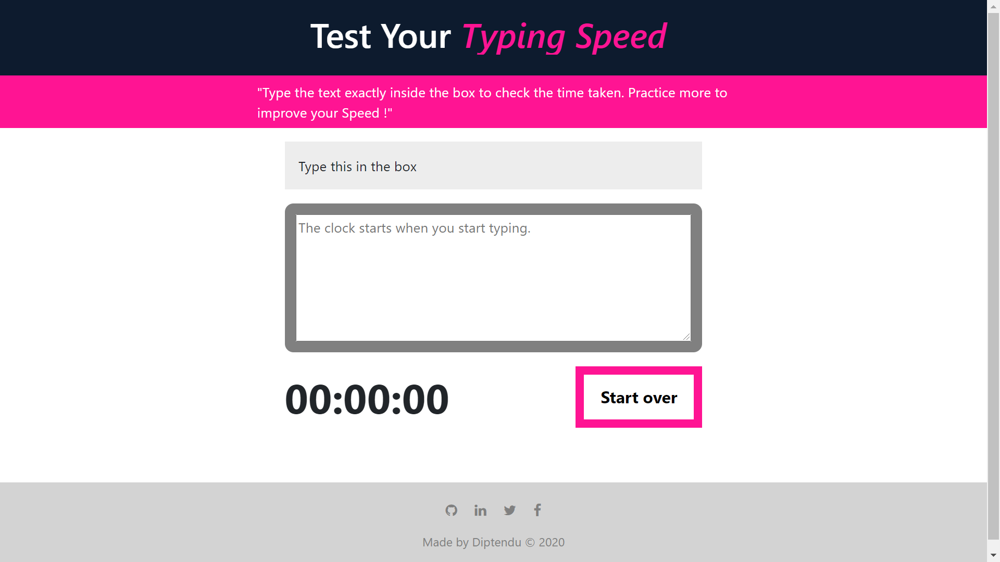

# Typing Speed Check 


[](https://github.com/deespider/Typing-Speed-Check/network)
[](https://github.com/deespider/Typing-Speed-Check/stargazers)
[](https://github.com/deespider/Typing-Speed-Check/issues)


<br />
<p align ="center">
  <a href="https://github.com/deespider/Typing-Speed-Check">
    
  </a>
</p>


<!-- TABLE OF CONTENTS -->
<details open="open">
  <summary>Table of Contents</summary>
  <ol>
    <li>
      <a href="#about-the-project">About The Project</a>
    </li>
    <li>
      <a href="#getting-started">Getting Started</a>
      <ul>
        <li><a href="#🔧installation">Installation</a></li>
      </ul>
    </li>
    <li><a href="#📈usage">Usage</a></li>
    <li><a href="#💚contributing">Contributing</a></li>
    <li><a href="#📜license">License</a></li>
  </ol>
</details>


## About The Project

A web app to test and improve your typing speed. It consist of a text area and timmer to calculate the time taken to complete the given sentence.

## Technologies Used
- Vanilla Javascript
- CSS
- Html 5
- Node
- Docker

## ✨ Main Features
- 🖥️ Responsive
- 🌈 Color signal
<!-- - 🅰️samples -->


<br>

### Framework Used

* [Bootstrap](https://getbootstrap.com)

<br>

## Getting Started

This is an example of how you may give instructions on setting up your project locally.
To get a local copy up and running follow these simple example steps.
<br>

### 🔧Installation

1. Clone the repo
   ```sh
   git clone https://github.com/your_username_/Project-Name.git
   ```

2. Run Docker container
  (For Better portability)
   ```sh
   docker build .
   ```
    ```sh
   docker tag <imageID> deespider/typespeed
   ```
    ```sh
   docker run-p 8000:8000 deespider/typespeed
   ```
    Now app will run in this port.

## 📈Usage

Once installing done go in the _index.html_ page to test the application 


## 💚Contributing 

Contributions are what make the open source community such an amazing place to be learn, inspire, and create. Any contributions you make are **greatly appreciated**.

1. Fork the Project
2. Create your Feature Branch (`git checkout -b feature`)
3. Commit your Changes (`git commit -m 'Added some Feature or Tool'`)
4. Push to the Branch (`git push origin feature`)
5. Open a Pull Request


## 📜License

Distributed under the MIT License. See `LICENSE` for more information.


